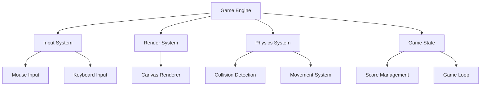
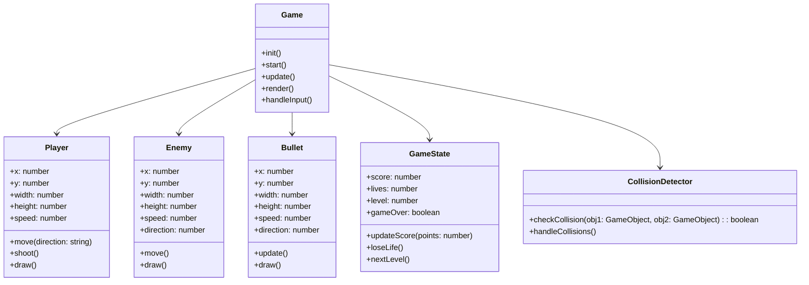
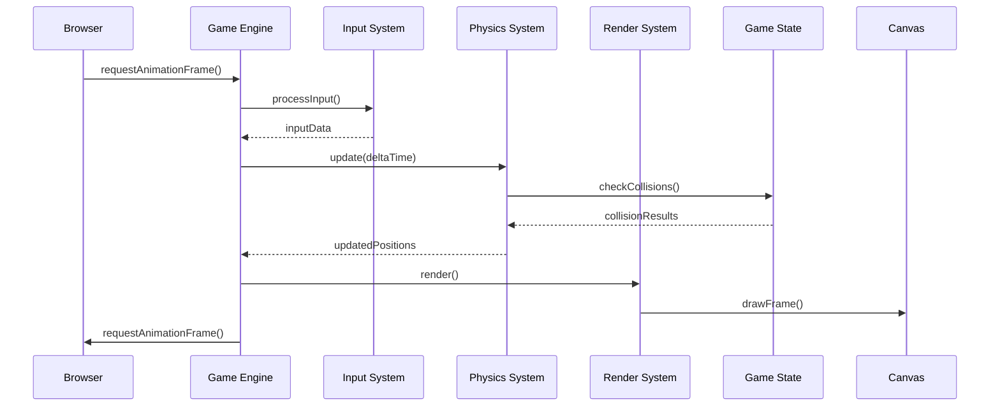
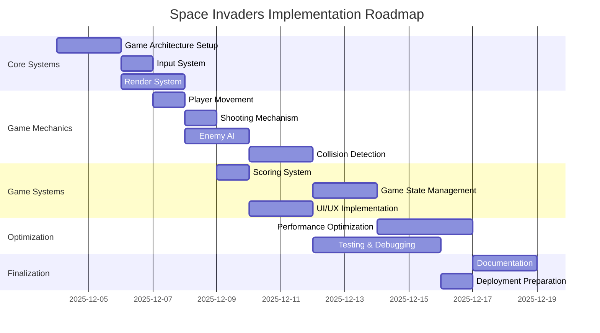

# Space Invaders Game - Technical Design Document

## 1. Game Architecture Overview

The Space Invaders game will be implemented as a browser-based game using HTML5 Canvas, JavaScript, and CSS. The architecture follows a component-based design with clear separation of concerns.

### High-Level Architecture Diagram



## 2. Core Components and Relationships

### Component Diagram



## 3. Detailed Specifications

### 3.1 Player Ship Movement (Horizontal Mouse Tracking)

**Implementation Details:**
- Player ship moves horizontally based on mouse X position
- Movement constrained to game canvas boundaries
- Smooth tracking with optional easing for better UX

**Technical Specifications:**
```javascript
// Player movement algorithm
function updatePlayerPosition(mouseX) {
    // Constrain to canvas boundaries
    const constrainedX = Math.max(
        PLAYER_WIDTH / 2,
        Math.min(mouseX, canvas.width - PLAYER_WIDTH / 2)
    );

    // Apply easing for smooth movement
    player.x += (constrainedX - player.x) * 0.1;
}
```

### 3.2 Shooting Mechanism (Click-Based)

**Implementation Details:**
- Player shoots by clicking mouse button
- Cooldown period between shots (300ms)
- Bullets originate from player ship center
- Maximum of 3 bullets on screen simultaneously

**Technical Specifications:**
```javascript
// Shooting mechanism
function handleShooting() {
    if (Date.now() - lastShotTime > SHOT_COOLDOWN && bullets.length < MAX_BULLETS) {
        const bullet = new Bullet(
            player.x,
            player.y - PLAYER_HEIGHT/2,
            BULLET_WIDTH,
            BULLET_HEIGHT,
            BULLET_SPEED,
            -1 // Direction: -1 for upward
        );
        bullets.push(bullet);
        lastShotTime = Date.now();
    }
}
```

### 3.3 Enemy Movement Patterns

**Implementation Details:**
- Enemies move in formation with periodic direction changes
- Formation moves horizontally and descends after reaching edges
- Individual enemy movement speed increases with level
- Special enemy types with unique movement patterns

**Technical Specifications:**
```javascript
// Enemy movement algorithm
function updateEnemyFormation() {
    const edgeReached = enemies.some(enemy => {
        return enemy.x + enemy.width > canvas.width || enemy.x < 0;
    });

    if (edgeReached) {
        // Change direction and descend
        enemyDirection *= -1;
        enemies.forEach(enemy => {
            enemy.y += ENEMY_DESCENT_AMOUNT;
            enemy.x += enemyDirection * enemy.speed;
        });
    } else {
        // Normal horizontal movement
        enemies.forEach(enemy => {
            enemy.x += enemyDirection * enemy.speed;
        });
    }
}
```

### 3.4 Collision Detection System

**Implementation Details:**
- Axis-Aligned Bounding Box (AABB) collision detection
- Optimized spatial partitioning for performance
- Collision response system for different object types

**Technical Specifications:**
```javascript
// Collision detection
function checkCollision(obj1, obj2) {
    return (
        obj1.x < obj2.x + obj2.width &&
        obj1.x + obj1.width > obj2.x &&
        obj1.y < obj2.y + obj2.height &&
        obj1.y + obj1.height > obj2.y
    );
}

// Collision handling
function handleCollisions() {
    // Player bullets vs enemies
    bullets.forEach((bullet, bulletIndex) => {
        enemies.forEach((enemy, enemyIndex) => {
            if (checkCollision(bullet, enemy)) {
                // Handle collision
                gameState.updateScore(ENEMY_POINTS);
                bullets.splice(bulletIndex, 1);
                enemies.splice(enemyIndex, 1);
            }
        });
    });

    // Enemy bullets vs player
    enemyBullets.forEach((bullet, bulletIndex) => {
        if (checkCollision(bullet, player)) {
            gameState.loseLife();
            enemyBullets.splice(bulletIndex, 1);
        }
    });
}
```

### 3.5 Scoring System

**Implementation Details:**
- Points awarded for destroying enemies
- Bonus points for consecutive hits
- High score persistence using localStorage
- Score multiplier for higher levels

**Technical Specifications:**
```javascript
// Scoring system
class GameState {
    constructor() {
        this.score = 0;
        this.lives = 3;
        this.level = 1;
        this.gameOver = false;
        this.consecutiveHits = 0;
        this.highScore = parseInt(localStorage.getItem('highScore')) || 0;
    }

    updateScore(points) {
        this.consecutiveHits++;
        const multiplier = 1 + Math.floor(this.consecutiveHits / 5);
        const levelBonus = this.level * 0.5;
        const totalPoints = points * multiplier * levelBonus;

        this.score += totalPoints;

        if (this.score > this.highScore) {
            this.highScore = this.score;
            localStorage.setItem('highScore', this.highScore);
        }
    }

    loseLife() {
        this.lives--;
        this.consecutiveHits = 0;

        if (this.lives <= 0) {
            this.gameOver = true;
        }
    }

    nextLevel() {
        this.level++;
        this.consecutiveHits = 0;
    }
}
```

### 3.6 Game State Management

**Implementation Details:**
- Centralized game state object
- State transitions (menu, playing, paused, game over)
- Event-based state changes
- Persistent state across game sessions

**Technical Specifications:**
```javascript
// Game state management
const GAME_STATES = {
    MENU: 'menu',
    PLAYING: 'playing',
    PAUSED: 'paused',
    GAME_OVER: 'gameOver',
    LEVEL_COMPLETE: 'levelComplete'
};

class GameStateManager {
    constructor() {
        this.currentState = GAME_STATES.MENU;
        this.previousState = null;
        this.stateHistory = [];
    }

    changeState(newState) {
        this.previousState = this.currentState;
        this.currentState = newState;
        this.stateHistory.push({
            from: this.previousState,
            to: newState,
            timestamp: Date.now()
        });

        // Dispatch state change event
        document.dispatchEvent(new CustomEvent('stateChange', {
            detail: { newState, previousState: this.previousState }
        }));
    }

    canTransitionTo(newState) {
        const validTransitions = {
            [GAME_STATES.MENU]: [GAME_STATES.PLAYING],
            [GAME_STATES.PLAYING]: [GAME_STATES.PAUSED, GAME_STATES.GAME_OVER, GAME_STATES.LEVEL_COMPLETE],
            [GAME_STATES.PAUSED]: [GAME_STATES.PLAYING, GAME_STATES.MENU],
            [GAME_STATES.GAME_OVER]: [GAME_STATES.MENU],
            [GAME_STATES.LEVEL_COMPLETE]: [GAME_STATES.PLAYING, GAME_STATES.MENU]
        };

        return validTransitions[this.currentState].includes(newState);
    }
}
```

## 4. HTML/CSS Structure

### HTML Structure

```html
<!DOCTYPE html>
<html lang="en">
<head>
    <meta charset="UTF-8">
    <meta name="viewport" content="width=device-width, initial-scale=1.0">
    <title>Space Invaders</title>
    <link rel="stylesheet" href="styles.css">
</head>
<body>
    <div class="game-container">
        <canvas id="gameCanvas" width="800" height="600"></canvas>

        <div class="game-ui">
            <div class="score-display">Score: <span id="score">0</span></div>
            <div class="lives-display">Lives: <span id="lives">3</span></div>
            <div class="level-display">Level: <span id="level">1</span></div>
            <div class="high-score-display">High Score: <span id="highScore">0</span></div>
        </div>

        <div class="game-overlay" id="menuOverlay">
            <h1>Space Invaders</h1>
            <button id="startButton">Start Game</button>
            <div class="instructions">
                <p>Move: Mouse</p>
                <p>Shoot: Click</p>
            </div>
        </div>

        <div class="game-overlay" id="gameOverOverlay">
            <h1>Game Over</h1>
            <p>Your Score: <span id="finalScore">0</span></p>
            <button id="restartButton">Play Again</button>
        </div>
    </div>

    <script src="game.js"></script>
</body>
</html>
```

### CSS Structure

```css
/* Base Styles */
body {
    margin: 0;
    padding: 0;
    font-family: 'Arial', sans-serif;
    background-color: #000;
    color: #fff;
    overflow: hidden;
}

/* Game Container */
.game-container {
    display: flex;
    flex-direction: column;
    align-items: center;
    justify-content: center;
    height: 100vh;
    width: 100vw;
}

/* Canvas Styles */
#gameCanvas {
    background-color: #000;
    border: 2px solid #0f0;
    box-shadow: 0 0 20px rgba(0, 255, 0, 0.5);
}

/* UI Elements */
.game-ui {
    position: absolute;
    top: 20px;
    left: 20px;
    display: flex;
    flex-direction: column;
    gap: 10px;
    font-family: 'Courier New', monospace;
    color: #0f0;
    text-shadow: 0 0 5px #0f0;
}

.game-ui div {
    font-size: 18px;
}

/* Overlays */
.game-overlay {
    position: absolute;
    top: 0;
    left: 0;
    width: 100%;
    height: 100%;
    display: flex;
    flex-direction: column;
    align-items: center;
    justify-content: center;
    background-color: rgba(0, 0, 0, 0.8);
    z-index: 10;
}

.game-overlay h1 {
    font-size: 48px;
    margin-bottom: 30px;
    text-align: center;
    color: #0f0;
    text-shadow: 0 0 10px #0f0;
}

button {
    padding: 12px 24px;
    font-size: 18px;
    background-color: #0f0;
    color: #000;
    border: none;
    border-radius: 4px;
    cursor: pointer;
    transition: all 0.2s;
    font-family: 'Courier New', monospace;
}

button:hover {
    background-color: #0a0;
    transform: scale(1.05);
}

.instructions {
    margin-top: 20px;
    font-size: 16px;
    text-align: center;
}
```

## 5. JavaScript Class Structure and Key Functions

### Class Structure

```javascript
// Main Game Class
class SpaceInvadersGame {
    constructor(canvasId) {
        this.canvas = document.getElementById(canvasId);
        this.ctx = this.canvas.getContext('2d');
        this.gameState = new GameState();
        this.player = new Player(this.canvas.width/2, this.canvas.height - 50);
        this.enemies = [];
        this.bullets = [];
        this.enemyBullets = [];
        this.inputHandler = new InputHandler();
        this.collisionDetector = new CollisionDetector();
        this.lastFrameTime = 0;
        this.init();
    }

    init() {
        this.setupEventListeners();
        this.createEnemies();
        this.startGameLoop();
    }

    setupEventListeners() {
        // Mouse movement for player control
        this.canvas.addEventListener('mousemove', (e) => {
            const rect = this.canvas.getBoundingClientRect();
            const mouseX = e.clientX - rect.left;
            this.player.move(mouseX);
        });

        // Click for shooting
        this.canvas.addEventListener('click', () => {
            this.player.shoot(this.bullets);
        });

        // UI buttons
        document.getElementById('startButton').addEventListener('click', () => {
            this.gameState.changeState(GAME_STATES.PLAYING);
        });

        document.getElementById('restartButton').addEventListener('click', () => {
            this.resetGame();
            this.gameState.changeState(GAME_STATES.PLAYING);
        });
    }

    createEnemies() {
        const rows = 5;
        const cols = 10;
        const enemyWidth = 40;
        const enemyHeight = 30;
        const padding = 20;
        const startX = (this.canvas.width - (cols * (enemyWidth + padding))) / 2;
        const startY = 50;

        for (let row = 0; row < rows; row++) {
            for (let col = 0; col < cols; col++) {
                const x = startX + col * (enemyWidth + padding);
                const y = startY + row * (enemyHeight + padding);
                const speed = 1 + (row * 0.2); // Faster enemies in lower rows
                this.enemies.push(new Enemy(x, y, enemyWidth, enemyHeight, speed));
            }
        }
    }

    update(deltaTime) {
        // Update player
        this.player.update();

        // Update bullets
        this.bullets.forEach((bullet, index) => {
            bullet.update();
            if (bullet.y < 0) {
                this.bullets.splice(index, 1);
            }
        });

        // Update enemy bullets
        this.enemyBullets.forEach((bullet, index) => {
            bullet.update();
            if (bullet.y > this.canvas.height) {
                this.enemyBullets.splice(index, 1);
            }
        });

        // Update enemies
        this.enemies.forEach(enemy => {
            enemy.update();
            // Random enemy shooting
            if (Math.random() < 0.002) {
                this.enemyBullets.push(new Bullet(
                    enemy.x + enemy.width/2,
                    enemy.y + enemy.height,
                    5, 15, 3, 1
                ));
            }
        });

        // Check collisions
        this.collisionDetector.handleCollisions(
            this.player,
            this.enemies,
            this.bullets,
            this.enemyBullets,
            this.gameState
        );

        // Check win condition
        if (this.enemies.length === 0) {
            this.gameState.nextLevel();
            this.createEnemies();
        }

        // Check game over
        if (this.gameState.gameOver) {
            this.gameState.changeState(GAME_STATES.GAME_OVER);
        }
    }

    render() {
        // Clear canvas
        this.ctx.clearRect(0, 0, this.canvas.width, this.canvas.height);

        // Draw player
        this.player.draw(this.ctx);

        // Draw bullets
        this.bullets.forEach(bullet => bullet.draw(this.ctx));
        this.enemyBullets.forEach(bullet => bullet.draw(this.ctx));

        // Draw enemies
        this.enemies.forEach(enemy => enemy.draw(this.ctx));

        // Draw UI
        this.drawUI();
    }

    drawUI() {
        // Update UI elements
        document.getElementById('score').textContent = this.gameState.score;
        document.getElementById('lives').textContent = this.gameState.lives;
        document.getElementById('level').textContent = this.gameState.level;
        document.getElementById('highScore').textContent = this.gameState.highScore;
    }

    startGameLoop() {
        const gameLoop = (timestamp) => {
            const deltaTime = timestamp - this.lastFrameTime;
            this.lastFrameTime = timestamp;

            this.update(deltaTime);
            this.render();

            requestAnimationFrame(gameLoop);
        };

        requestAnimationFrame(gameLoop);
    }

    resetGame() {
        this.gameState = new GameState();
        this.player = new Player(this.canvas.width/2, this.canvas.height - 50);
        this.enemies = [];
        this.bullets = [];
        this.enemyBullets = [];
        this.createEnemies();
    }
}
```

### Key Functions

```javascript
// Input Handling
class InputHandler {
    constructor() {
        this.keys = {};
        this.mouseX = 0;
        this.mouseY = 0;

        window.addEventListener('keydown', (e) => {
            this.keys[e.key] = true;
        });

        window.addEventListener('keyup', (e) => {
            this.keys[e.key] = false;
        });

        window.addEventListener('mousemove', (e) => {
            this.mouseX = e.clientX;
            this.mouseY = e.clientY;
        });
    }

    isKeyDown(key) {
        return this.keys[key] || false;
    }

    getMousePosition() {
        return { x: this.mouseX, y: this.mouseY };
    }
}

// Game Object Base Class
class GameObject {
    constructor(x, y, width, height) {
        this.x = x;
        this.y = y;
        this.width = width;
        this.height = height;
    }

    draw(ctx) {
        // To be implemented by subclasses
    }

    update() {
        // To be implemented by subclasses
    }
}

// Player Class
class Player extends GameObject {
    constructor(x, y) {
        super(x, y, 50, 30);
        this.speed = 5;
        this.color = '#0f0';
        this.lastShotTime = 0;
    }

    move(mouseX) {
        // Smooth movement toward mouse position
        this.x += (mouseX - this.x) * 0.1;

        // Constrain to canvas boundaries
        this.x = Math.max(
            this.width / 2,
            Math.min(this.x, canvas.width - this.width / 2)
        );
    }

    shoot(bullets) {
        const now = Date.now();
        if (now - this.lastShotTime > 300 && bullets.length < 3) {
            bullets.push(new Bullet(
                this.x,
                this.y - this.height/2,
                5, 15, 7, -1
            ));
            this.lastShotTime = now;
        }
    }

    draw(ctx) {
        ctx.fillStyle = this.color;
        ctx.beginPath();
        ctx.moveTo(this.x, this.y);
        ctx.lineTo(this.x - this.width/2, this.y + this.height);
        ctx.lineTo(this.x + this.width/2, this.y + this.height);
        ctx.closePath();
        ctx.fill();
    }
}

// Enemy Class
class Enemy extends GameObject {
    constructor(x, y, width, height, speed) {
        super(x, y, width, height);
        this.speed = speed;
        this.direction = 1;
        this.color = this.getRandomColor();
    }

    getRandomColor() {
        const colors = ['#f00', '#0ff', '#f0f', '#ff0', '#0f0'];
        return colors[Math.floor(Math.random() * colors.length)];
    }

    update() {
        this.x += this.speed * this.direction;
    }

    draw(ctx) {
        ctx.fillStyle = this.color;
        ctx.fillRect(this.x, this.y, this.width, this.height);

        // Draw enemy details
        ctx.strokeStyle = '#fff';
        ctx.lineWidth = 2;
        ctx.strokeRect(this.x, this.y, this.width, this.height);
    }
}

// Bullet Class
class Bullet extends GameObject {
    constructor(x, y, width, height, speed, direction) {
        super(x, y, width, height);
        this.speed = speed;
        this.direction = direction;
        this.color = '#0f0';
    }

    update() {
        this.y += this.speed * this.direction;
    }

    draw(ctx) {
        ctx.fillStyle = this.color;
        ctx.fillRect(this.x, this.y, this.width, this.height);
    }
}

// Collision Detector
class CollisionDetector {
    checkCollision(obj1, obj2) {
        return (
            obj1.x < obj2.x + obj2.width &&
            obj1.x + obj1.width > obj2.x &&
            obj1.y < obj2.y + obj2.height &&
            obj1.y + obj1.height > obj2.y
        );
    }

    handleCollisions(player, enemies, playerBullets, enemyBullets, gameState) {
        // Player bullets vs enemies
        playerBullets.forEach((bullet, bulletIndex) => {
            enemies.forEach((enemy, enemyIndex) => {
                if (this.checkCollision(bullet, enemy)) {
                    gameState.updateScore(10 * gameState.level);
                    playerBullets.splice(bulletIndex, 1);
                    enemies.splice(enemyIndex, 1);
                }
            });
        });

        // Enemy bullets vs player
        enemyBullets.forEach((bullet, bulletIndex) => {
            if (this.checkCollision(bullet, player)) {
                gameState.loseLife();
                enemyBullets.splice(bulletIndex, 1);
            }
        });

        // Enemies vs player (collision)
        enemies.forEach((enemy) => {
            if (this.checkCollision(enemy, player)) {
                gameState.loseLife();
            }
        });
    }
}
```

## 6. Game Loop Implementation

### Game Loop Design



### Implementation Details

```javascript
// Game Loop Implementation
class GameLoop {
    constructor(game) {
        this.game = game;
        this.lastFrameTime = 0;
        this.fps = 60;
        this.frameInterval = 1000 / this.fps;
        this.then = Date.now();
        this.start();
    }

    start() {
        requestAnimationFrame(this.loop.bind(this));
    }

    loop(now) {
        // Calculate delta time
        const deltaTime = now - this.then;

        // Only update if enough time has passed
        if (deltaTime > this.frameInterval) {
            this.then = now - (deltaTime % this.frameInterval);

            // Update game state
            this.game.update(deltaTime);

            // Render game
            this.game.render();
        }

        // Continue the loop
        requestAnimationFrame(this.loop.bind(this));
    }
}

// Alternative: Fixed timestep game loop
class FixedTimestepGameLoop {
    constructor(game, fixedTimestep = 1000/60) {
        this.game = game;
        this.fixedTimestep = fixedTimestep;
        this.accumulator = 0;
        this.lastTime = performance.now();
        this.animationFrameId = null;
    }

    start() {
        this.lastTime = performance.now();
        this.animationFrameId = requestAnimationFrame(this.loop.bind(this));
    }

    stop() {
        if (this.animationFrameId) {
            cancelAnimationFrame(this.animationFrameId);
        }
    }

    loop(currentTime) {
        // Calculate time since last frame
        const deltaTime = currentTime - this.lastTime;
        this.lastTime = currentTime;

        // Add to accumulator
        this.accumulator += deltaTime;

        // Update game with fixed timestep
        while (this.accumulator >= this.fixedTimestep) {
            this.game.update(this.fixedTimestep);
            this.accumulator -= this.fixedTimestep;
        }

        // Render (interpolation can be added here)
        this.game.render();

        // Continue loop
        this.animationFrameId = requestAnimationFrame(this.loop.bind(this));
    }
}
```

## 7. Performance Considerations

### Optimization Strategies

1. **Spatial Partitioning for Collision Detection**
   - Implement grid-based collision detection
   - Only check collisions between objects in same or adjacent cells

2. **Object Pooling**
   - Reuse bullet objects instead of creating/destroying
   - Pre-allocate object pools for frequently created/destroyed objects

3. **Canvas Optimization**
   - Use multiple canvas layers for static vs dynamic elements
   - Implement dirty rectangle rendering
   - Use `ctx.clearRect()` strategically

4. **Memory Management**
   - Implement garbage collection for unused objects
   - Use weak references where appropriate

5. **Rendering Optimization**
   - Implement frame skipping when performance is low
   - Use requestAnimationFrame with performance monitoring
   - Implement adaptive quality based on device capabilities

### Performance Monitoring

```javascript
// Performance Monitor Class
class PerformanceMonitor {
    constructor() {
        this.frameTimes = [];
        this.maxFrames = 60;
        this.fps = 0;
        this.lastSecond = performance.now();
        this.frameCount = 0;
    }

    update() {
        const now = performance.now();
        this.frameCount++;

        if (now - this.lastSecond >= 1000) {
            this.fps = this.frameCount;
            this.frameCount = 0;
            this.lastSecond = now;
        }

        // Store frame time
        const frameTime = performance.now() - this.lastFrameTime;
        this.frameTimes.push(frameTime);

        if (this.frameTimes.length > this.maxFrames) {
            this.frameTimes.shift();
        }

        this.lastFrameTime = performance.now();
    }

    getAverageFrameTime() {
        if (this.frameTimes.length === 0) return 0;
        const sum = this.frameTimes.reduce((a, b) => a + b, 0);
        return sum / this.frameTimes.length;
    }

    getFPS() {
        return this.fps;
    }

    isPerformanceCritical() {
        return this.getAverageFrameTime() > 16; // > 60fps threshold
    }
}
```

### Memory Management Strategies

```javascript
// Object Pool Implementation
class ObjectPool {
    constructor(createFn, resetFn) {
        this.createFn = createFn;
        this.resetFn = resetFn;
        this.pool = [];
        this.activeObjects = [];
    }

    get() {
        if (this.pool.length > 0) {
            const obj = this.pool.pop();
            this.resetFn(obj);
            this.activeObjects.push(obj);
            return obj;
        } else {
            const obj = this.createFn();
            this.activeObjects.push(obj);
            return obj;
        }
    }

    release(obj) {
        const index = this.activeObjects.indexOf(obj);
        if (index !== -1) {
            this.activeObjects.splice(index, 1);
            this.pool.push(obj);
        }
    }

    releaseAll() {
        this.activeObjects.forEach(obj => this.pool.push(obj));
        this.activeObjects = [];
    }

    getActiveCount() {
        return this.activeObjects.length;
    }

    getPoolSize() {
        return this.pool.length;
    }
}
```

## Implementation Roadmap



## Technical Requirements

- **Browser Support**: Chrome 90+, Firefox 88+, Safari 14+, Edge 90+
- **Performance Target**: 60 FPS on mid-range devices
- **Memory Usage**: < 100MB
- **Input Latency**: < 50ms
- **Load Time**: < 2 seconds

## Dependencies

- No external dependencies required
- Pure HTML5 Canvas, JavaScript ES6+, CSS3
- Optional: LocalStorage for high score persistence

## Future Enhancements

1. **Multiplayer Support**: WebSocket-based multiplayer mode
2. **Level Editor**: Custom level creation tool
3. **Power-ups**: Special abilities and weapons
4. **Sound Effects**: Audio system with volume control
5. **Mobile Support**: Touch controls and responsive design
6. **Save/Load**: Game progress persistence
7. **Achievements**: In-game achievement system